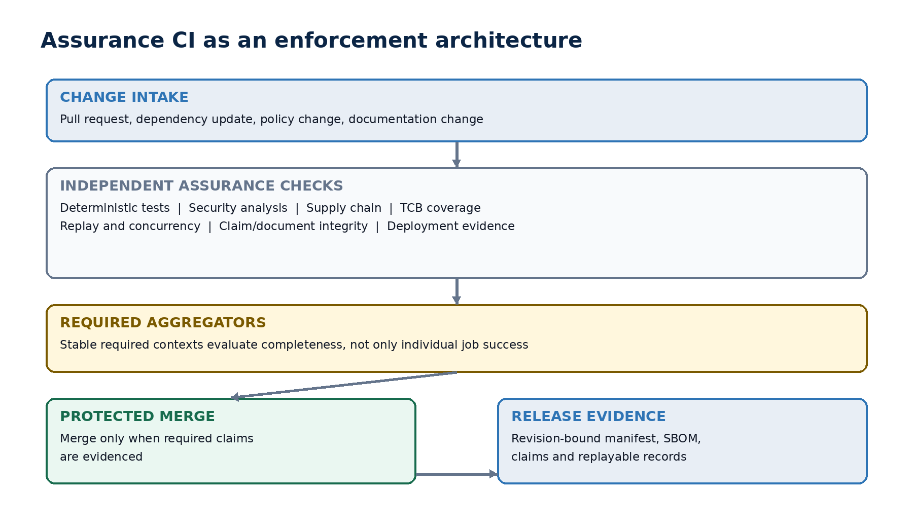
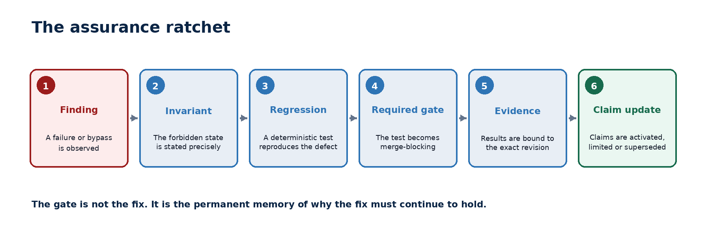

# Assurance CI

[](https://github.com/darklordVirtual/Assurance-CI-/actions/workflows/assurance-ci.yml)
[](docs/architecture/ASSURANCE_CI_ARCHITECTURE.md)
[](CHANGELOG.md)

Assurance CI is a repository-level enforcement architecture for turning safety findings into permanent, revision-bound merge conditions.

> A serious failure is not closed when the code changes. It is closed when recurrence becomes detectable, evidence-producing and merge-blocking at the correct boundary.



## Why this repository exists

High-velocity, AI-assisted engineering can outpace a reviewer's ability to reconstruct every prior failure mode and architectural constraint. More test jobs alone do not solve that problem. Assurance CI separates:

1. **Evidence production** from merge authority.
2. **Dynamic execution** from stable required contexts.
3. **Transport success** from verified external effect.
4. **Research claims** from the evidence required to keep them active.
5. **A patch** from the permanent regression gate that remembers why it must hold.

This repository formalizes those contracts and provides machine-checkable starter artifacts. It is an architecture proposal, not a claim that complete system safety or production effectiveness has already been established.

## Assurance ratchet

| Step | Required result |
|---|---|
| Finding | Record the affected surface, threat scenario and consequence. |
| Invariant | State the forbidden state or transition precisely. |
| Regression | Reproduce the defect deterministically. |
| Required gate | Make recurrence merge-blocking under a stable context. |
| Evidence | Bind the result to revision, workflow, policy and artifact digests. |
| Claim update | Activate, limit or supersede the affected claim without erasing history. |



## Canonical artifacts

- [Architecture specification](docs/architecture/ASSURANCE_CI_ARCHITECTURE.md)
- [Versioned Word release](docs/releases/Assurance_CI_Architecture_REMORA_v1.0.docx)
- [Architecture decision record](docs/adr/0001-assurance-ci-as-a-first-class-subsystem.md)
- [Evidence envelope schema](schemas/assurance-evidence-envelope.schema.json)
- [Assurance profile schema](schemas/assurance-profile.schema.json)
- [Research release profile](policy/research-release-v1.yaml)
- [Claim registry](registry/claims.yaml)
- [Finding registry](registry/findings.yaml)

## Repository map

```text
.
├── .github/                 Workflow, ownership and contribution templates
├── checksums/               Release and figure integrity manifest
├── docs/
│   ├── architecture/        Canonical human-readable specification
│   ├── adr/                 Architecture decisions
│   ├── figures/             Version-controlled diagrams
│   └── releases/            Immutable document releases
├── examples/                Synthetic evidence envelopes
├── policy/                  Revision-controlled assurance profiles
├── registry/                Claims and findings that drive the ratchet
├── schemas/                 Machine-readable contracts
└── scripts/                 Dependency-free repository validation
```

## Validate locally

```bash
python3 scripts/validate_repository.py
sha256sum --check checksums/SHA256SUMS
```

The same checks run on pull requests and on `main`. The workflow has read-only repository permissions and uses an immutable commit reference for checkout.

## Stable required contexts proposed for REMORA

| Required context | Authority domain |
|---|---|
| `quality-gates-required` | Code, documentation, claims and component coverage |
| `deterministic-suite-required` | Deterministic execution and policy invariants |
| `supply-chain-required` | Dependencies, provenance, SBOM and artifact integrity |
| `codeql-required` | Static security analysis |
| `shadow-replay` | Behavioral drift against recorded governed traces |

These names are policy interfaces. Individual producer jobs may evolve, but a protected branch should depend on stable aggregators whose semantics cannot silently weaken.

## Relationship to REMORA

Assurance CI emerged from the engineering pattern visible in REMORA Research: failures are captured as negative results, converted into explicit invariants and retained as regression gates. This repository extracts that pattern into an independently inspectable architecture that can be evaluated and reused beyond one codebase.

## Governance

Changes that weaken a critical invariant, required producer, failure posture or evidence field require:

1. An explicit architecture decision record.
2. A documented impact on active claims and prior findings.
3. Independent review.
4. A replacement control or an explicit scope reduction.

See [GOVERNANCE.md](GOVERNANCE.md) and [CONTRIBUTING.md](CONTRIBUTING.md).

## Citation

Use [CITATION.cff](CITATION.cff) or cite the versioned architecture release as **REMORA-ACA-001, version 1.0 (2026)**.
